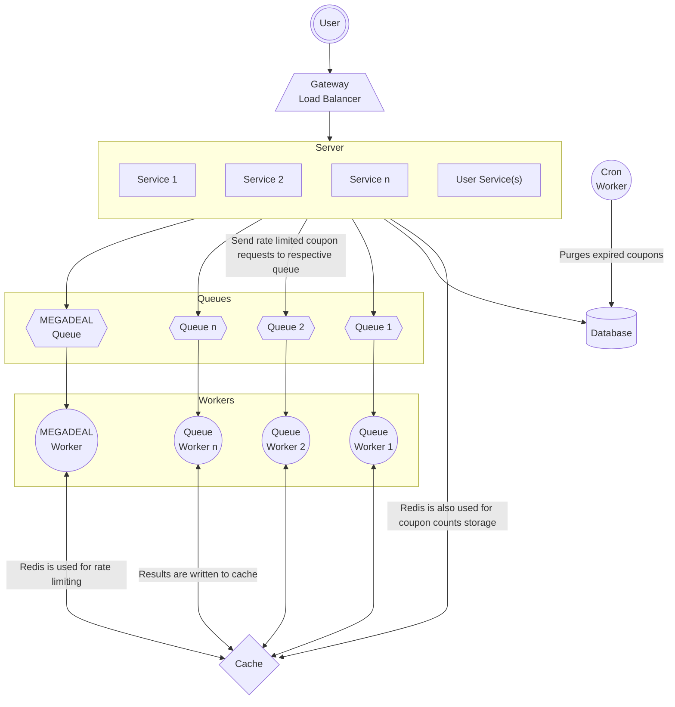
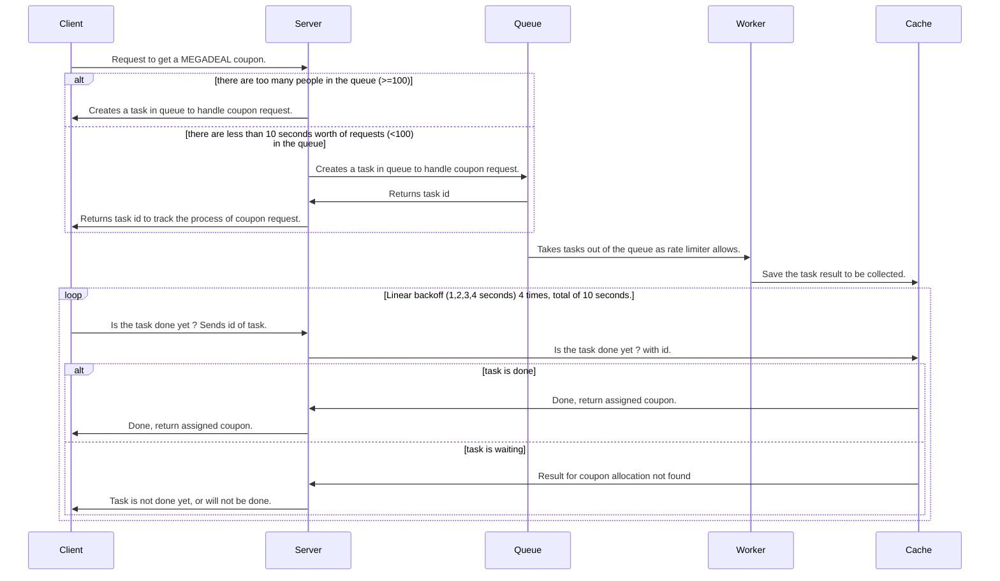

## System Architecture
> **_NOTE:_** This document contains mermaidJS charts, a version of this document rendered properly can be viewed at the link. https://github.com/ozzy-cox/coupon-management-system/blob/main/docs.md

> If you can't view the diagrams, they are included in the source as flowchart.png and sequence.png

#### Assumptions
* Each coupon can be assigned to a single user.
* Requesting a coupon without a type will return the first coupon without a type.
* Requesting a coupon with a type will return the first coupon with a type.
* MEGADEAL
  * No more than 5 concurrent requests for megadeal will be processed.
  * Coupons can be requested a maximum of 10 times within a second. I interpreted this and the next statement saying users can wait up to 10 seconds for a megadeal coupon as users will be queued up to get this type of coupon and will have to wait up to 10 seconds, if the queue is longer than 10 seconds i.e there are 100 requests lined up. Remaining will be discarded.

* A cron job runs the purge coupons method with arbitrary frequency. (A week maybe)
* Count of total uploaded and redeemed coupons per coupon type are stored in redis.
* All operations are logged
* Coupons are persisted in a relational database, though repository pattern is used to allow for easy transition to other persistent storage providers.

#### Design Considerations

* App is made as a single js application for the sake of brevity.
* In order for it to be a single app without external dependencies, the necessary dependencies are either mocked or lightweight version of them are used.
  * SQLite for storage. (Instead of PostgreSQL)
  * ioredis-mock for process memory redis mocking. This is almost a fully functional redis mock in process memory.(Instead of a running redis instance)
  * Bee-queue is used for queueing tasks. (Instead of RabbitMQ etc.)
  * Queue workers are implemented using **worker_threads**. (Instead of seperate microservices)
  * Logs are written to file. (Instead of ElasticSearch, where some analysis could be made.)
  * Rate limiter and id generator is embedded in code, Ideally these would be seperate components to allow for better scalability, concurrency.
  * Load balancer/gateway was not implemented.

